<!-- 🕷️ Spider-Man BLACK Theme -->

 

<table align="center">
<tr>
<td width="35%" align="center" valign="middle">

</td>

<td width="65%" valign="middle">

## 🕷️ My Projects

| Project | Tech | |
|:---|:---|:---:|
| 🏋️ **FitTrack** | `Python` `Django` `Docker` | 🚀 |
| 🤖 **AI Chatbot** | `Python` `Streamlit` `Gemini API` | 🧠 |
| ❄️ **Snowfall Prediction** | `Python` `ML` `Random Forest` | ❄️ |
| ♟️ **Sunfish Chess Game** | `Python` `Chess Engine` | ♟️ |

> 🕸️ *Code • Learn • Build • Repeat.*

</td>
</tr>
</table>

 

---

## 🕷️ GitHub Stats

 

## 🔥 GitHub Streak

 

## 📈 Contribution Graph

 

## 🏆 Spider-Verse Achievements

 

## 🐍 Watch the Spider-Snake Eat My Contributions

<picture>
  <source media="(prefers-color-scheme: dark)"
          srcset="https://raw.githubusercontent.com/Ritiksen04/Ritiksen04/output/github-snake-dark.svg">
  <source media="(prefers-color-scheme: light)"
          srcset="https://raw.githubusercontent.com/Ritiksen04/Ritiksen04/output/github-snake.svg">
  
</picture>

 

## 🕸️ Tech Web

 

## 📫 Let's Connect

  

  

🕷️ **RITIK SEN**  
`SPIDER-MAN MODE` • `DATA SCIENCE` • `ML BUILDER`

  

*With great power comes great responsibility — with great code comes great builds.*

